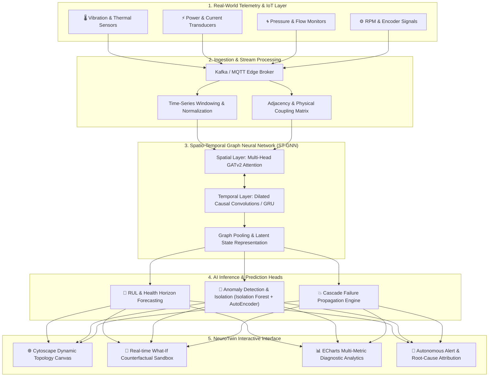

# 🧠 NeuroTwin — AI-Powered Neural Digital Twin Platform

[](https://nextjs.org/)
[](https://react.dev/)
[](https://www.typescriptlang.org/)
[](https://tailwindcss.com/)
[](https://js.cytoscape.org/)
[](https://echarts.apache.org/)

> **NeuroTwin** is a state-of-the-art industrial Digital Twin platform powered by **Spatio-Temporal Graph Neural Networks (ST-GNNs)**. It mirrors complex manufacturing facilities as dynamic, interdependent topological graphs—predicting critical component degradation, tracking cascading anomalies, and stress-testing operational resilience through real-time "What-If" simulations.

---

## ⚡ System Architecture & AI Pipeline

NeuroTwin models industrial systems not as isolated machines, but as a living, interconnected physical-neural continuum. Sensor telemetry flows continuously through temporal feature extractors, spatial message-passing layers, and predictive heads.



---

## 🏭 Plant Topology & Dependency Graph

In the simulated smart manufacturing plant, each node represents a mission-critical asset, while edges represent physical mass flow, electrical distribution, or kinetic coupling:

```
[ Power Grid Substation (PU-01) ]
         │
         ├───▶ [ Main Drive Motor (MTR-01) ] ────▶ [ Primary Compressor (CMP-01) ]
         │              │                                     │
         │              ▼                                     ▼
         │     [ Coolant Pump (PMP-01) ] ──────────▶ [ Closed-Loop Chiller (COL-01) ]
         │              │                                     │
         ▼              ▼                                     ▼
 [ CNC Milling Cell (MCH-01) ] ───────────────▶ [ Automated Assembly Line (LNE-01) ]
         ▲                                                    ▲
         │                                                    │
 [ Hydraulic Press (MCH-02) ] ────────────────────────────────┘
```

### Edge Dynamics:
- **Mass / Thermal Coupling**: Increased temperature in `MTR-01` alters viscosity and thermal load into `COL-01`.
- **Pressure Coupling**: Drop in `CMP-01` pressure creates pneumatic starvation downstream in `LNE-01`.
- **Cascade Factor**: GNN edge weights adapt dynamically based on mutual influence and learned cross-sensor correlations.

---

## 🔬 Core Features & Interactive Capabilities

### 1. 🌐 Real-Time Neural Digital Twin Topology
- **Interactive Graph Canvas**: Rendered via Cytoscape with hardware-accelerated Bezier curves, status-coded aura pulses, and directional animated particle flow.
- **Deep Node Inspection**: Click any component to reveal full dynamic telemetry (temperature, pressure, vibration, load, RPM, kW), maintenance schedules, and upstream/downstream blast radius.
- **Cluster & System Filtering**: Instant filtering by status (Healthy, Warning, Critical, Offline) and equipment class.

### 2. 🧪 "What-If" Counterfactual Simulation Engine
Simulate real-world industrial stress scenarios before executing physical adjustments:
- **Parameter Override Sandbox**: Artificially spike thermal load, throttle pump RPM, or sever power lines.
- **Cascade Failure Modeling**: Watch failure waves propagate through the graph in step-by-step slow motion, showing propagation velocity, secondary risk zones, and expected time-to-failure.
- **Comparative Diff Mode**: Side-by-side delta visualization of baseline operational state vs. simulated counterfactual scenario.

### 3. 🔮 Multi-Horizon Predictive Analytics
- **Forecasting Horizons**: Predict component states at **+15m, +1h, +6h, +24h, and +7d**.
- **Probabilistic Confidence Intervals**: Dual-band confidence intervals (p10, p50, p90) highlighting sensor uncertainty.
- **Remaining Useful Life (RUL)**: Continuous degradation curve estimation and predictive maintenance triggers.

### 4. 🚨 Intelligent Anomaly Detection & Root-Cause Attribution
- **Multi-Sensor Autoencoder Reconstruction**: Detect subtle micro-drifts before traditional hard thresholds trigger.
- **Root-Cause Attribution Graph**: Directly identifies whether an anomaly is locally generated or imported from an upstream dependency.
- **Explainable AI (XAI)**: Feature contribution breakdown (SHAP-style) pinpointing why the model flagged the asset.

---

## 📐 Spatio-Temporal Graph Neural Network Architecture

```
                    Input Node Features X_t ∈ ℝ^(N × F)
                                   │
                                   ▼
        ┌─────────────────────────────────────────────────────┐
        │       Spatial Attention Layer (GATv2 Conv)          │
        │  α_ij = softmax(LeakyReLU(aᵀ [W h_i || W h_j || e_ij])) │
        └─────────────────────────────────────────────────────┘
                                   │
                                   ▼
        ┌─────────────────────────────────────────────────────┐
        │      Temporal Convolutional Block (TCN / GRU)       │
        │    Captures multi-scale temporal dependencies & lag │
        └─────────────────────────────────────────────────────┘
                                   │
                                   ▼
        ┌─────────────────────────────────────────────────────┐
        │              Latent Graph Embedding                 │
        │          Z = LayerNorm(Spatial ⊕ Temporal)          │
        └─────────────────────────────────────────────────────┘
                   ┌───────────────┼───────────────┐
                   ▼               ▼               ▼
            [State Prediction] [Anomaly Head] [Cascade Matrix]
```

---

## 🛠️ Technology Stack

| Layer | Technologies |
|---|---|
| **Framework** | [Next.js 16 (App Router)](https://nextjs.org/) + [React 19](https://react.dev/) |
| **Language** | [TypeScript 5](https://www.typescriptlang.org/) (Strict Mode) |
| **Styling & Theme** | [Tailwind CSS v4](https://tailwindcss.com/) with Cyber-Industrial Dark Theme |
| **Graph Visualization** | [Cytoscape.js](https://js.cytoscape.org/) + `react-cytoscapejs` |
| **Telemetry Charts** | [Apache ECharts 6](https://echarts.apache.org/) + `echarts-for-react` |
| **Motion & Micro-interactions** | [Framer Motion](https://www.framer.com/motion/) |
| **Iconography** | [Lucide React](https://lucide.dev/) |

---

## 🚀 Quick Start Guide

### Prerequisites
- Node.js 18.18+ or 20+
- npm or pnpm or yarn

### Installation

```bash
# Clone the repository
git clone https://github.com/RohithKumar086/NeuroTwin.git

# Navigate into the project folder
cd NeuroTwin

# Install dependencies
npm install

# Start the development server
npm run dev
```

Open [http://localhost:3000](http://localhost:3000) in your browser.

### Available Scripts

| Command | Action |
|---|---|
| `npm run dev` | Starts the Next.js Turbopack development server |
| `npm run build` | Compiles the production build with type checking |
| `npm run start` | Launches the compiled production application |
| `npm run lint` | Runs ESLint across all TypeScript and TSX sources |

---

## 🗺️ Project Structure

```
NeuroTwin/
├── src/
│   ├── app/                     # Next.js App Router routes
│   │   ├── page.tsx             # Executive Overview & KPI Dashboard
│   │   ├── digital-twin/        # Interactive Digital Twin Live Workspace
│   │   ├── graph/               # System Graph & Dependency Matrix
│   │   ├── predictions/         # Multi-Horizon State Forecasting
│   │   ├── simulation/          # What-If Cascade Simulator
│   │   ├── anomalies/           # Anomaly Detection & Diagnosis
│   │   ├── sensors/             # Real-time Telemetry & Stream Status
│   │   ├── model/               # Neural Network Architecture Specs
│   │   ├── events/              # Alert Center & Audit Trail
│   │   ├── settings/            # System & Simulation Parameters
│   │   └── globals.css          # Cyber-Industrial CSS & Tailwind Theme
│   ├── components/
│   │   ├── dashboard/           # KPI cards, quick view panels
│   │   ├── graph/               # Cytoscape canvas & node detail inspector
│   │   ├── layout/              # Header, Sidebar, Global status bar
│   │   └── ui/                  # Reusable badges, cards, skeleton loaders
│   ├── data/                    # Realistic simulated industrial datasets
│   ├── hooks/                   # System state & telemetry simulation hooks
│   ├── services/                # Graph algorithms & prediction engines
│   └── types/                   # Strict TypeScript schemas & definitions
├── public/                      # Static assets
├── tsconfig.json                # TypeScript configuration with @/* alias
├── package.json                 # Dependencies and build scripts
└── README.md                    # Project documentation
```

---

## 🔮 Production Roadmap

- [ ] **Hardware Bridge**: Native MQTT / OPC-UA / Modbus connector daemon for live factory floor integration.
- [ ] **ONNX Runtime Web**: In-browser edge inference of GNN checkpoints directly via WebGL / WebGPU.
- [ ] **3D Spatial Twin**: WebGL / Three.js 3D facility layout overlay paired with 2D topological graph.
- [ ] **Autonomous Dispatch**: Automated control-loop feedback sending setpoint adjustments back to PLCs upon cascade risk detection.

---

## 📄 License

MIT License © 2026 Rohith Kumar. Built for next-generation industrial intelligence.
